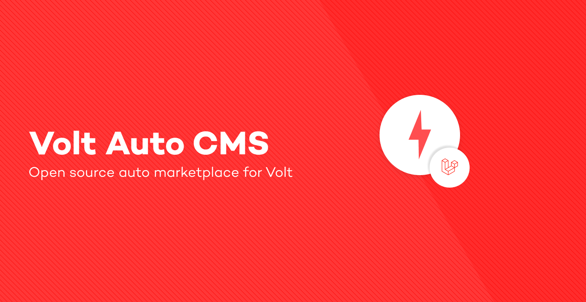

<p align="center"><a href="https://laravel.com" target="_blank"></a></p>

  </br>

  <a href="https://github.com/volt/admin-dashboard#contribute" target="_blank">
    
  </a>

  <a href="https://standardjs.com" target="_blank">
    
  </a>


  <a href="https://github.com/nsfw-filter/nsfw-filter/blob/master/LICENSE" target="_blank">
    
  <a/>
</p>
<hr>

# Table of contents

<!-- - [Usage](#usage) -->

- [Installation](#installation)
  - [Docker](#docker)
  - [Manual](#manual)
- [Environmental Variables](#environmental-variables)

<!-- 
# Usage
Login to the latest version of the dashboard at [admin..com](https://admin.metroipo.com). -->

# Installation

*For **development only**.*

**Recommended**: The project comes with a [docker](#docker) dev container with all dependencies, php extensions and services set up already, 
however, you can always set up the dependencies [manually](#manual). 
Clone this repository and navigate inside the project folder, copy `.env`, build/start containers:

```sh
λ git clone https://github.com/VoltAuto/cms
λ cp .env.example .env
λ cd cms/docker
λ docker compose up -d
```

## Docker

Generally, the following commands are run _after_ "logging" into the php container

```bash
# List the running containers
λ docker container ls --format "table {{.ID}}\t{{.Image}}\t{{.Names}}" 

CONTAINER ID   IMAGE                         NAMES
7337267930d0   volt-php                      docker-app-1
f09a8d18b60a   nginx:1.21.6-alpine           docker-nginx-1
0860c95d16c0   mariadb                       docker-db-1
43bc1ce20641   getmeili/meilisearch:latest   docker-meilisearch-1
92c2973a2035   redis:6.2-alpine              docker-redis-1

# "Log" into the php container
λ docker exec -it docker-app-1 /bin/bash                                                                                     master ⬆ ✭ ✱ ◼
volt-user@7337267930d0:/var/www$ #Inside PHP Container
```

After logging into the docker container, we can install dependencies, run migrations composer is 
already installed.

```bash
λ composer install
λ php artisan migrate
λ php artisan db:seed
```

We need to index `meilisearch` Vehicle models for searching with

```bash
λ php artisan scout:import "App\Models\Vehicle"
```
Finally, install node dependencies and compile assets with [Laravel Mix](https://laravel-mix.com/) and [yarn](https://yarnpkg.com/)
```bash
# Install Node dependencies
λ yarn
# Compile Assets
λ yarn dev
```

## Manual

The "Manual" method for development, just means you have to set up the required services _and_ dependencies
locally, Volt uses the following stack:

- [MariaDB](https://mariadb.org/)
- [Redis](https://redis.io/)
- [Meilisearch](https://www.meilisearch.com/)
- [Nginx](https://www.nginx.com/) (Optional for Local)

Refer to the installation of each to install. After local services have been installed and
[Environmental Variables](#environmental-variables) have been configured install dependencies with [composer](https://getcomposer.org/).

```bash
λ composer install
λ php artisan migrate
λ php artisan db:seed
```
We also need to index `meilisearch` Vehicle models for searching with

```bash
λ php artisan scout:import "App\Models\Vehicle"
```
Finally, install node dependencies and compile assets with [Laravel Mix](https://laravel-mix.com/) and [yarn](https://yarnpkg.com/)
```bash
# Install Node dependencies
λ yarn
# Compile Assets
λ yarn dev
```

### Environmental Variables

The following variables are required for database connectivity:

- `DB_CONNECTION`
- `DB_HOST`
- `DB_PORT`
- `DB_DATABASE`
- `DB_USERNAME`
- `DB_PASSWORD`

The following are required for sending emails:

- `MAIL_MAILER`
- `MAIL_HOST`
- `MAIL_PORT`
- `MAIL_USERNAME`
- `MAIL_PASSWORD`
- `MAIL_ENCRYPTION`

The following are required for index searching with 
[Laravel Scout](https://laravel.com/docs/10.x/scout) and [Meilisearch](https://www.meilisearch.com/):

- `SCOUT_DRIVER`
- `MEILISEARCH_HOST`

After installing the dependencies and configuring environmental variables, head over to [localhost](http://localhost).


